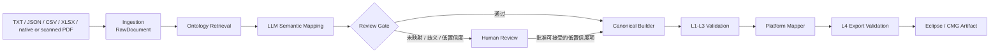

# Ontology-Driven Reservoir Data Translator

面向油藏数值模拟资料的语义转换 PoC：把异构的 TXT、JSON、CSV、XLSX、
原生文本 PDF 和整页扫描 PDF（可选 OCR）
资料转换为统一的 Canonical Data Model，再由确定性程序生成 Eclipse/OPM
INCLUDE 或 CMG Demo 片段。

> **PoC v0.1 已于 2026-09-02 完成阶段性收口。** 当前结论是“技术路线和
> Demo 闭环成立”，不是“已经达到生产环境或商业模拟器认证标准”。详细证据和
> 边界见 [PoC 收口报告](docs/POC_CLOSURE.md)。

## 我们想解决什么

油藏工程资料通常来自不同客户、文件格式和字段体系。人工转换既要理解自然语言和
表格语义，又要处理单位、物理约束和模拟器 Keyword 语法，过程重复且难以审计。

本项目验证一条可追溯的转换路线：

- LLM 只负责非确定性的“这段资料表达了什么”；
- Company Ontology 定义统一的业务语义；
- Canonical Model 是平台无关的唯一内部表达；
- 单位换算、模型构建、校验和目标文件生成全部由确定性代码负责；
- 缺失、歧义或低置信度信息必须停在人工审查门，不允许模型猜测补全。

## 系统如何工作



一次 `/translate` 请求按以下顺序运行：

1. Parser 只解析文件结构，生成带来源位置的 `RawDocument/RawBlock`。
2. Retriever 从 Ontology 和外部 Source Mapping 中提供受控候选。
3. DeepSeek 返回结构化 `MAPPED/UNMAPPED/AMBIGUOUS` 结果；系统重新校验
   Concept、Canonical Path、单位、结构值和实体关系。
4. Review Gate 阻断未解决项和置信度低于 0.80 的结果。
5. `CanonicalBuilder` 做单位归一和平台无关模型构建，不创造缺失值。
6. L1-L3 分别验证 Schema、Ontology 实例约束和领域规则。
7. Eclipse/CMG Mapper 生成确定性目标中间模型与文本，L4 验证目标可导出性。
8. 响应返回 translation ID、各阶段 trace、Canonical、Validation 和目标片段。

完整的组件职责、启动逻辑和异常分支见
[项目总览与运行逻辑](docs/PROJECT_OVERVIEW.md)。

## 当前 PoC 能力

| 能力 | 当前状态 |
|---|---|
| 输入 | TXT、JSON、CSV、XLSX、原生文本 PDF，以及可选 PaddleOCR 整页扫描 PDF；PDF 保留 page、bbox、阅读顺序、分块 span 和提取证据 |
| 语义层 | 外部 YAML Ontology、Source Mapping、受控检索、DeepSeek V4 Flash |
| Canonical | Rock、Fluid/PVT、SCAL、Well/Control、Schedule |
| 单位 | 压力、速率、黏度、密度、时间、压缩系数的受控换算 |
| 安全门 | UNMAPPED、AMBIGUOUS、低置信度阻断；浏览器会话内人工批准 |
| 校验 | L1 Schema、L2 Ontology、L3 Domain、L4 Platform Export |
| Eclipse | `SWOF/PVDO/PVDG/PVTW/DENSITY/ROCK/WCONPROD/WCONINJE/TSTEP` |
| CMG | 未冻结版本的 IMEX-style 井控 Demo 片段 |
| 接口 | 六个分阶段 FastAPI endpoint 和完整 `/translate` 流水线 |
| UI | 本地 Upload/Paste → Mapping → Review → Canonical → Export 工作台 |

## 快速开始

要求 Python 3.12+。

```bash
python3 -m venv .venv
.venv/bin/python -m pip install '.[dev,opm]'
.venv/bin/ontology-validate ontology
.venv/bin/python -m pytest
.venv/bin/uvicorn reservoir_data_translator.api.main:app --reload
```

浏览器打开 `http://127.0.0.1:8000/`。在没有 Provider 凭据时，确定性 endpoint
仍可使用，语义转换 endpoint 会明确返回 `SEMANTIC_PROVIDER_NOT_CONFIGURED`。

应用默认使用延迟加载的 PaddleOCR 后端：普通文本 PDF 不加载模型，只有扫描件或禁止
文本提取但可渲染的 PDF 才进入 OCR。OCR 默认使用 `gpu:0`；部署时先按
[运行手册](docs/RUNBOOK.md#21-可选-ocr-依赖)从官方 CUDA 源安装 GPU 运行时，再安装 OCR 依赖：

```bash
.venv/bin/python -m pip install '.[ocr]'
export RESERVOIR_OCR_LANGUAGES='ch,en'
```

CPU 运行时与 GPU 运行时不要同时安装。GPU 不可用时网页会明确报错，系统不自动退回 CPU；
仅需 CPU 的部署可安装 `.[ocr-cpu]` 并显式设置 `RESERVOIR_OCR_DEVICE=cpu`。

PDF 声明禁止复制/文本提取时，系统会自动逐页渲染并进入 OCR，不生成中间 PDF；
提取证据会记录 `SOURCE_TEXT_EXTRACTION_RESTRICTED`。只有页面无法打开或渲染、OCR
依赖不可用、识别失败或置信度不足时才中止。

当前 OCR 范围是“整个 PDF 均为扫描页”。原生文本 PDF 继续使用已有解析流程；同时包含
原生页和扫描页的混合 PDF 会返回 `PDF_HYBRID_UNSUPPORTED`，不会静默拼接不完整结果。
OCR 输出会适配成既有的 `text`、`table`、`figure` `RawBlock`，所以下游
Retriever、Semantic Mapping 和 Canonical 流程无需改造。完整配置见
[运行手册](docs/RUNBOOK.md#4-扫描-pdf-ocr-配置)。

真实转换会把逐次 DeepSeek 请求、Token、Prompt 和响应审计写入被 Git 忽略的
`artifacts/deepseek_traces/`，并可在结果页按按钮展开。该目录包含客户原始内容，
不可提交或直接分享；可用 `DEEPSEEK_TRACE_DIR` 改到项目外的受控目录。

DeepSeek 凭据建议通过环境变量提供：

```bash
export DEEPSEEK_API_KEY='your-key'
export DEEPSEEK_MODEL='deepseek-v4-flash'
.venv/bin/uvicorn reservoir_data_translator.api.main:app --reload
```

项目也兼容 `DEEPSEEK_API_KEY_FILE`；凭据文件、运行 artifact、Prompt 和模型原始
响应都不应提交到 Git。更完整的启动、验证和故障排查命令见
[运行手册](docs/RUNBOOK.md)。

## PoC 验收命令

不调用外部模型的本地门禁：

```bash
.venv/bin/python -m pytest
.venv/bin/ontology-validate ontology --json
.venv/bin/python -m pip check
```

在明确配置 DeepSeek 凭据后，完整 Demo 验收链为：

```bash
.venv/bin/python scripts/evaluate_demo_deepseek.py
```

该脚本执行：Demo 原文 → DeepSeek → Semantic Mapping → Canonical → L1-L4 →
Eclipse INCLUDE → OPM 2025.10 Parser → Golden 语义比较，并把不含密钥/Prompt 的
本地证据写入 `artifacts/demo_deepseek_evaluation/`。

## 仓库结构

```text
.
├── src/reservoir_data_translator/
│   ├── ingestion/      # 文件结构解析
│   ├── ontology/       # Ontology 加载、Registry、定义校验
│   ├── semantic/       # 检索、Source Mapping、Provider、语义安全门
│   ├── canonical/      # 平台无关模型与确定性 Builder
│   ├── validation/     # L1-L4 与 OPM Parser 对比
│   ├── mappers/        # Eclipse / CMG 确定性 Mapper
│   ├── api/            # FastAPI 分阶段接口与完整流水线
│   └── ui/             # 本地浏览器工作台
├── ontology/           # 平台/客户无关的 v0.1 Ontology
├── mappings/           # 客户 Source Mapping 与平台 Output Mapping
├── example/            # Demo 原文与 Eclipse 输出 Golden
├── scripts/            # 真实 Provider smoke / 完整验收脚本
├── tests/              # 自动化回归测试
└── docs/               # 项目说明、收口报告与运行手册
```

## 文档导航

- [`docs/PROGRAM_DESIGN_REFERENCE.md`](docs/PROGRAM_DESIGN_REFERENCE.md)：程序设计与代码结构参考，从总体调用链下钻到主要类和函数，并单独讨论 PDF ingestion 扩展边界。
- [项目总览与运行逻辑](docs/PROJECT_OVERVIEW.md)：我们想做什么、怎么做、系统现在如何运行。
- [PoC 收口报告](docs/POC_CLOSURE.md)：冻结范围、当前证据、完成结论和遗留边界。
- [运行手册](docs/RUNBOOK.md)：安装、启动、API、测试、真实模型验收和安全约束。
- [开发设计文档](DESIGN.md)：v0.1/v0.2 的详细设计合同与 Tasks 1-12。
- [设计完成度审计](DESIGN_COMPLETENESS.md)：逐 Task、逐层完成度矩阵。
- [Ontology 约定](ONTOLOGY_CONVENTIONS.md)：概念、别名、关系、单位和版本规则。
- [原始 PoC 企划](docs/archive/ORIGINAL_POC_BRIEF_ZH.md)：最初的业务目标与成功标准，作为历史基线保留。

## OCR 中间结果

工作台点击“开始翻译”后会提交后台任务。OCR 完成时即可展开“浏览 OCR 中间结果”，
也可浏览原始文件、下载中间 PDF 和原始 OCR JSON；此时语义映射可以仍在执行。
中间文件默认持久保存在项目的 `tmp/ocr_intermediates/`，名称为
`原始文件名_YYYY-MM-DD.pdf`，重名依次追加 `(2)`、`(3)`，不覆盖历史文件。
同名 `.raw.json` 保存模型的原始 JSON 输出，`.manifest.json` 保存页数、版本和完成状态。
低置信度拦截发生在保存之后；后续翻译失败不会删除中间文件。原生文本路径不生成 OCR 文件。
详细接口与运行边界见 [运行手册](docs/RUNBOOK.md#ocr-中间结果与后台任务)。

## 明确边界

- Eclipse 输出通过固定版本 OPM Python Parser 和输出 Golden 比较，但尚未在真实
  host deck 中运行 Flow，也未经过商业 ECLIPSE 认证。
- 当前没有带人工 Concept/Path 标签的代表性 Semantic Gold 数据集，因此不宣称
  extraction precision、recall 或 F1。
- Review 批准和 trace 仅在本次请求/浏览器会话内存在，没有持久化审批、回放或审计库。
- 后台任务队列仅在单个服务进程内运行；没有持久化任务恢复、分布式队列、认证授权、
  对象存储、多租户、生产监控和部署加固。
- CMG 只证明同一 Canonical 可驱动第二个平台 Mapper，不代表 CMG 语法已验证。

这些限制不会否定 PoC 结论，但它们决定了下一阶段应优先补“业务证据和真实消费”，
而不是继续无边界扩展架构。
